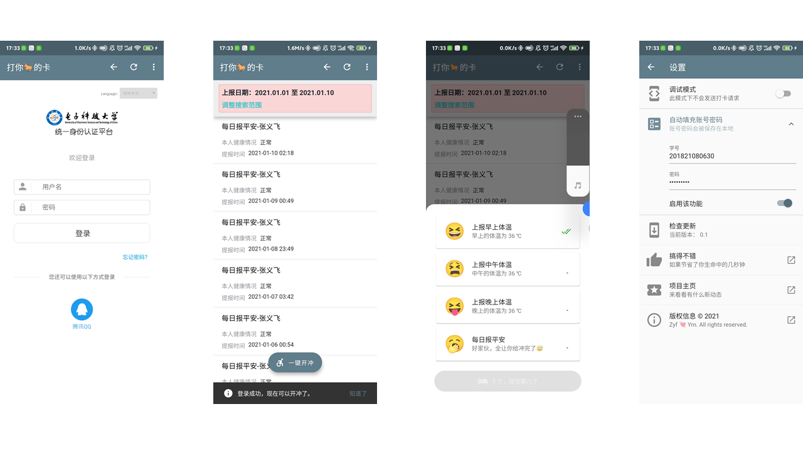

  
<h1 align="center">体温打卡</h1>

<b>电子科大研究生系统一键体温打卡和报平安。</b>

下载安装：<a href="https://github.com/Yidadaa/Auto-Check-Temperature/releases/latest/download/app-arm64-v8a-release.apk">arm 64 位版本（推荐）</a> | <a href="https://github.com/Yidadaa/Auto-Check-Temperature/releases/latest/download/app-armeabi-v7a-release.apk.apk">arm 32 位版本</a> | <a href="https://github.com/Yidadaa/Auto-Check-Temperature/releases/latest/download/app-x86_64-release.apk">x86 64 位版本</a> 

国内镜像：<a href="https://gitee.com/yidadaa/Auto-Check-Temperature">代码仓库</a> | <a href="https://gitee.com/yidadaa/Auto-Check-Temperature/releases">下载页</a>

 

## 安装提示
对于大多数用户，请优先尝试安装 arm 64 版本；如果安装失败，请尝试 arm 32 位版本。如果还不行，不会真的有人在用 intel 芯片的安卓手机吧？不会吧不会吧？

**提示：Github Releases 服务在国内属于被墙状态，所以建议使用<a href="https://gitee.com/yidadaa/Auto-Check-Temperature">国内镜像仓库</a>下载安装包。**

## 功能
1. 自动填充账号密码（完全本地存储，具体可看源码）；
2. 一键报平安和三次体温打卡，节省宝贵生命，有这时间为啥不去摸鱼呢（呲牙）。

## 开发

This project is a starting point for a Flutter application.

A few resources to get you started if this is your first Flutter project:

- [Lab: Write your first Flutter app](https://flutter.dev/docs/get-started/codelab)
- [Cookbook: Useful Flutter samples](https://flutter.dev/docs/cookbook)

For help getting started with Flutter, view our
[online documentation](https://flutter.dev/docs), which offers tutorials,
samples, guidance on mobile development, and a full API reference.
